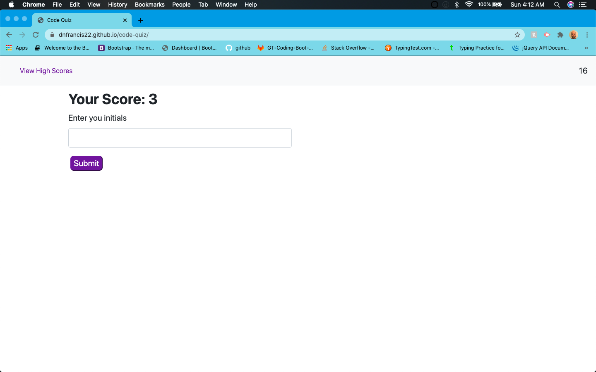

# code-quiz# Password-Generator

**Description**

This one program was created to give any one that is interested in code, a quick fun way to test their coding knowledge

**Installation**

Click on the settings tab.
Scroll down to the section that says GitHub Pages.
Click on the link in the green box next to "your site is published at".

Or you can just click here: https://dnfrancis22.github.io/code-quiz/

**Usage**

When the page loads you are given the instructions on how to play the game. You click the Start Quiz button to start the quiz.

After the question answer page loads the timer starts and you are presented with a question and multiple choice buttons with answers.

  
When you click on the answers you are alerted if you are correct or not and the the next question loads. Note: if you are wrong 10 seconds will be decremented from the timer.

When you have answered all of the questions or the timer runs out, The high score page will load. On the high score page you can enter your initials, clear them out or click the Go back button to play again.

**License**

MIT License

Copyright (c) [2020] [Dennis Francis]

Permission is hereby granted, free of charge, to any person obtaining a copy
of this software and associated documentation files (the "Software"), to deal
in the Software without restriction, including without limitation the rights
to use, copy, modify, merge, publish, distribute, sublicense, and/or sell
copies of the Software, and to permit persons to whom the Software is
furnished to do so, subject to the following conditions:

The above copyright notice and this permission notice shall be included in all
copies or substantial portions of the Software.

THE SOFTWARE IS PROVIDED "AS IS", WITHOUT WARRANTY OF ANY KIND, EXPRESS OR
IMPLIED, INCLUDING BUT NOT LIMITED TO THE WARRANTIES OF MERCHANTABILITY,
FITNESS FOR A PARTICULAR PURPOSE AND NONINFRINGEMENT. IN NO EVENT SHALL THE
AUTHORS OR COPYRIGHT HOLDERS BE LIABLE FOR ANY CLAIM, DAMAGES OR OTHER
LIABILITY, WHETHER IN AN ACTION OF CONTRACT, TORT OR OTHERWISE, ARISING FROM,
OUT OF OR IN CONNECTION WITH THE SOFTWARE OR THE USE OR OTHER DEALINGS IN THE
SOFTWARE.

